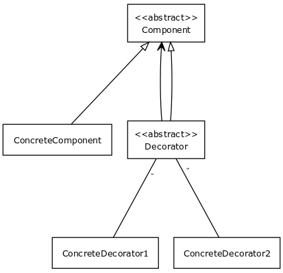

# Decorator Pattern

### Description

_Youtube:_ [Design Patterns in Object Oriented Programming](https://youtube.com/playlist?list=PLrhzvIcii6GNjpARdnO4ueTUAVR9eMBpc)

> A **decorator** class wraps another class called **base class** and extends its ability with new functionalities. The decorator class should have a common ancestor with the base class, whitch means it should be a class of the same type as the base class.



### Example

#### [decorator.ts](decorator.ts)

```typescript
/**
 * The base Component interface defines operations that can be altered by
 * decorators.
 */
export interface Component {
    operation(): string;
}

/**
 * Concrete Components provide default implementations of the operations. There
 * might be several variations of these classes.
 */
export class ConcreteComponent implements Component {
    public operation(): string {
        return "ConcreteComponent";
    }
}

/**
 * The base Decorator class follows the same interface as the other components.
 * The primary purpose of this class is to define the wrapping interface for all
 * concrete decorators. The default implementation of the wrapping code might
 * include a field for storing a wrapped component and the means to initialize
 * it.
 */
export class Decorator implements Component {
    protected component: Component;

    constructor(component: Component) {
        this.component = component;
    }

    /**
     * The Decorator delegates all work to the wrapped component.
     */
    public operation(): string {
        return this.component.operation();
    }
}

/**
 * Concrete Decorators call the wrapped object and alter its result in some way.
 */
export class ConcreteDecoratorA extends Decorator {
    /**
     * Decorators may call parent implementation of the operation, instead of
     * calling the wrapped object directly. This approach simplifies extension
     * of decorator classes.
     */
    public operation(): string {
        return `ConcreteDecoratorA(${super.operation()})`;
    }
}

/**
 * Decorators can execute their behavior either before or after the call to a
 * wrapped object.
 */
export class ConcreteDecoratorB extends Decorator {
    public operation(): string {
        return `ConcreteDecoratorB(${super.operation()})`;
    }
}
```

#### [decorator.test.ts](decorator.test.ts)

```typescript
import {
    Component,
    ConcreteComponent,
    ConcreteDecoratorA,
    ConcreteDecoratorB,
} from "./decorator";

console.log = jest.fn();

/**
 * The client code works with all objects using the Component interface. This
 * way it can stay independent of the concrete classes of components it works
 * with.
 */
function clientCode(component: Component) {
    console.log(`RESULT: ${component.operation()}`);
}

describe("Example usage of decorator pattern", () => {
    /**
     * This way the client code can siupport both simple components...
     */
    const simple = new ConcreteComponent();

    /**
     * ...as well as decorated one.
     *
     * Note how decorators can wrap not only simple components but other
     * decorators as well
     */
    const decorator1 = new ConcreteDecoratorA(simple);
    const decorator2 = new ConcreteDecoratorB(decorator1);

    test("Simple component", () => {
        clientCode(simple);

        expect(console.log).toHaveBeenCalledWith("RESULT: ConcreteComponent");
    });

    test("Decorated with Decorator1", () => {
        clientCode(decorator1);

        expect(console.log).toHaveBeenCalledWith(
            "RESULT: ConcreteDecoratorA( ConcreteComponent )"
        );
    });

    test("Decorated with Decorator2", () => {
        clientCode(decorator2);

        expect(console.log).toHaveBeenCalledWith(
            "RESULT: ConcreteDecoratorB( ConcreteDecoratorA( ConcreteComponent ) )"
        );
    });
});
```
