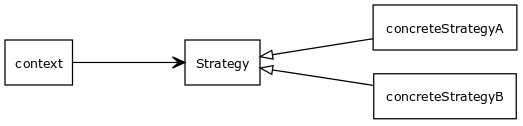

# Strategy Pattern

### Description

_Youtube:_ [Design Patterns in Object Oriented Programming](https://youtube.com/playlist?list=PLrhzvIcii6GNjpARdnO4ueTUAVR9eMBpc)

> It uses composition rather than inheritance. Inheritance is not ment for code reuse. The **strategy patterns** defines a family of algorithms. Encapsulates each one and makes them interchangeable. Strategy patterns lets the algorithms vary independently from clients that use it. Algoritm is decoupled from the client that uses it. Actually the strategy pattern is a dependency injection. The strategy is injected into the client.




### Example

#### [strategy.ts](strategy.ts)

```typescript
/**
 * The common interface for the algorithm family which makes algorithms interchangeable.
 */
export type Strategy = () => void;

/**
 * Concrete implementation of the strategy A.
 */
const concreteStrategyA: Strategy = () => console.log('ConcreteStrategyA has been executed');

/**
 * Concrete implementation of the strategy B.
 */
const concreteStrategyB: Strategy = () => console.log('ConcreteStrategyB has been executed');

/**
 * The context function which uses one of the strategies. The concrete implementation of
 * the used strategy will be injected runtime through parameter. The context method
 * has no knowledge about the concrete implementation of the strategy. It uses through
 * the Strategy interface, which makes the strategies interchangeable.
 */
function context(strategy: Strategy) {
    strategy();
}

/**
 * Client A which uses strategy A. Instead of inheriting strategy algorith  from
 * Context parent class, it uses composition to get access to the strategy class.
 */
export function clientA() {
    context(concreteStrategyA);
}

/**
 * Client B which uses strategy B. Instead of inheriting strategy algorith  from
 * Context parent class, it uses composition to get access to the strategy class.
 */
export function clientB() {
    context(concreteStrategyB);
}
```

#### [strategy.test.ts](strategy.test.ts)

```typescript
import {
  Strategy,
  clientA,
  clientB,
} from "./strategy";

console.log = jest.fn();

describe("Example usage of strategy pattern", () => {
  test("Creates a Client in which the ConcreteStrategyA will be executed", () => {
    clientA();
    expect(console.log).toHaveBeenCalledWith(
      "ConcreteStrategyA has been executed"
    );
  });

  test("Creates a Context in which the ConcreteStrategyB will be executed", () => {
    clientB();
    expect(console.log).toHaveBeenCalledWith(
      "ConcreteStrategyB has been executed"
    );
  });
});
```
