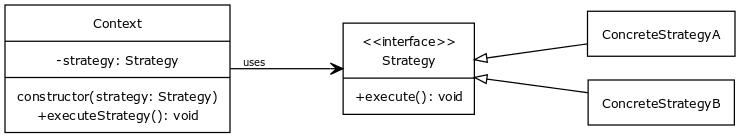

# Strategy Pattern 

### Description

_Youtube:_ [Design Patterns in Object Oriented Programming](https://youtube.com/playlist?list=PLrhzvIcii6GNjpARdnO4ueTUAVR9eMBpc)

> It uses composition rather than inheritance. Inheritance is not ment for code reuse. The **strategy patterns** defines a family of algorithms. Encapsulates each one and makes them interchangeable. Strategy patterns lets the algorithms vary independently from clients that use it. Algoritm is decoupled from the client that uses it. Actually the strategy pattern is a dependency injection. The strategy is injected into the client.




### Example

#### [strategy.ts](strategy.ts)

```typescript
/**
 * The common interface for the algorithm family which makes algorithms interchangeable.
 */
export interface Strategy {
    execute(): void;
}

/**
 * Concrete implementation of the strategy A.
 */
export class ConcreteStrategyA implements Strategy {
    public execute(): void {
        console.log('ConcreteStrategyA has been executed');
    }
}

/**
 * Concrete implementation of the strategy B.
 */
export class ConcreteStrategyB implements Strategy {
    public execute(): void {
        console.log('ConcreteStrategyB has been executed');
    }
}

/**
 * The Context class which uses one of the strategies. The concrete implementation of 
 * the used strategy will be injected runtime through constructor. The Context class
 * has no knowledge about the concrete implementation of the strategy. It uses through
 * the Strategy interface, which makes the strategies interchangeable.
 */
export class Context {
    private strategy: Strategy;

    /**
     * The concrete strategy implementation is injected through constructor.
     */
    constructor(strategy: Strategy) {
        this.strategy = strategy;
    }

    /**
     * Executing the strategy.
     */
    public executeStrategy(): void {
        this.strategy.execute();
    }
}
```

#### [strategy.test.ts](strategy.test.ts)

```typescript
import { Strategy, ConcreteStrategyA, ConcreteStrategyB, Context } from './strategy';

console.log = jest.fn();

/**
 * The client code works with the Strategy interface. This way
 * it can stay independent of the concrete strategy classes it 
 * works with. It creates a Context class in wich it injects a
 * concrete Strategy implementation. The context then it will 
 * use it without knowing which implementation it is.
 */
function clientCode(strategy: Strategy) {
    const context = new Context(strategy);
    context.executeStrategy();
}

describe('Example usage of strategy pattern', () => {

    it('Creates a Context in which the ConcreteStrategyA will be executed', () =>{
        clientCode(new ConcreteStrategyA());

        expect(console.log)
            .toHaveBeenCalledWith('ConcreteStrategyA has been executed');
    });

    it('Creates a Context in which the ConcreteStrategyB will be executed', () =>{
        clientCode(new ConcreteStrategyB());
        
        expect(console.log)
            .toHaveBeenCalledWith('ConcreteStrategyB has been executed');
    });

});
```
