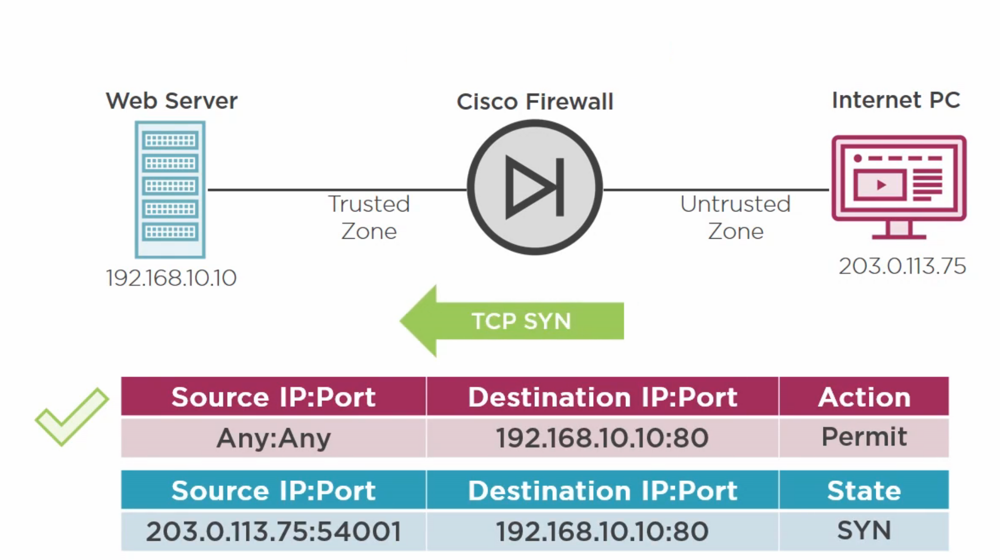
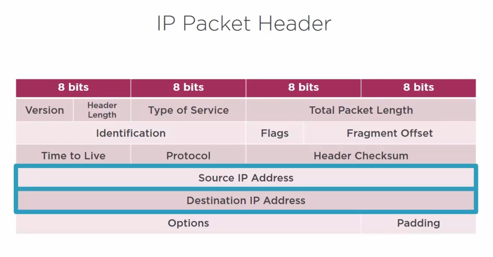
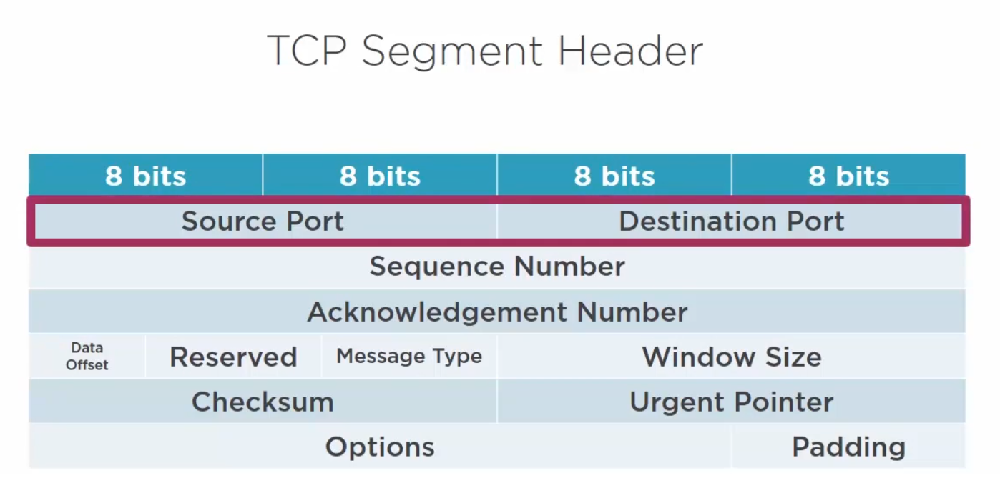
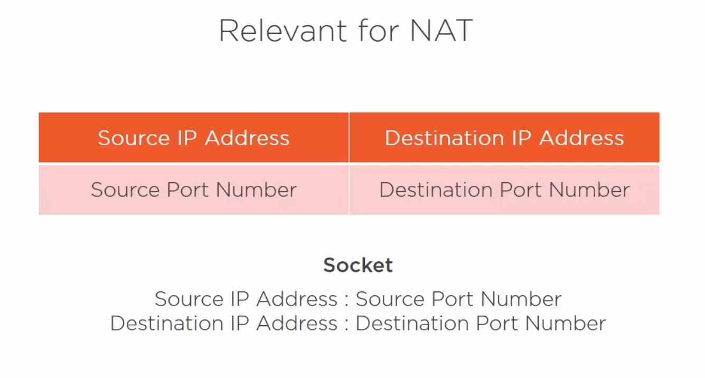

# Firewall

## Threat Avoidance / Detection Systems
- AAA / ID Management
- Firewall
- Intrusion detection System (IDS)
- URL Filter
- Virus Scanner
- Logging

### What is a firewall doing?
- Firewall grants **HTTP Request** access from Trusted Network to the Untrusted ones. But doesn't allows traffic in the other direction.

### Access Rules

## Network Address Translation (NAT)

### Network address translation

### Port address translation

