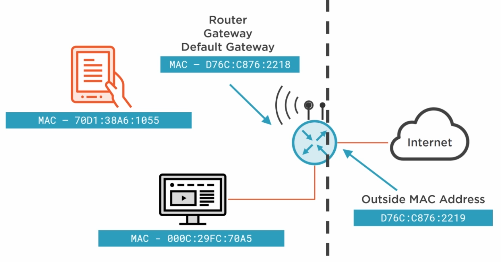
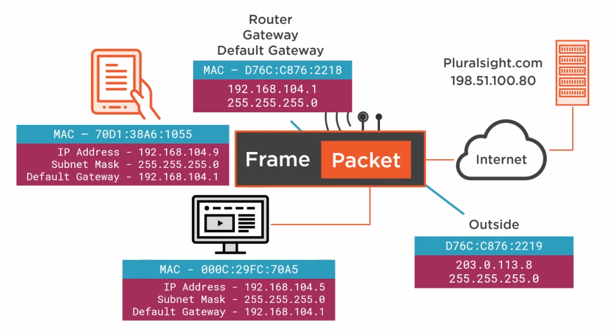
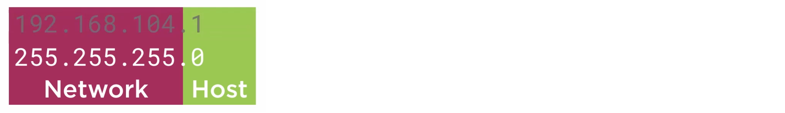
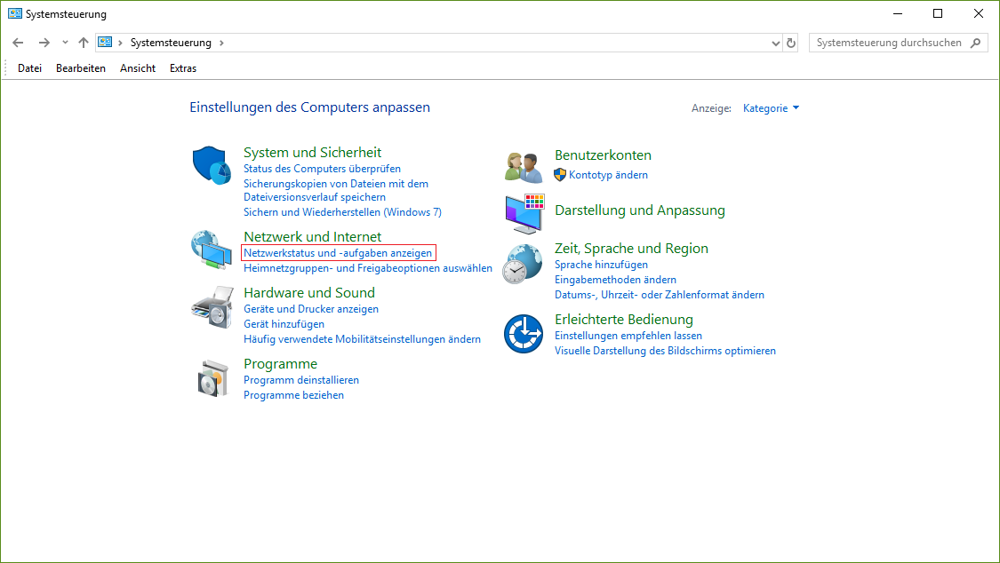
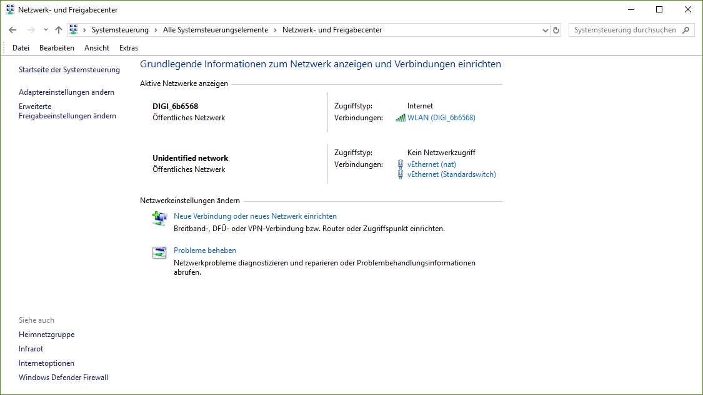
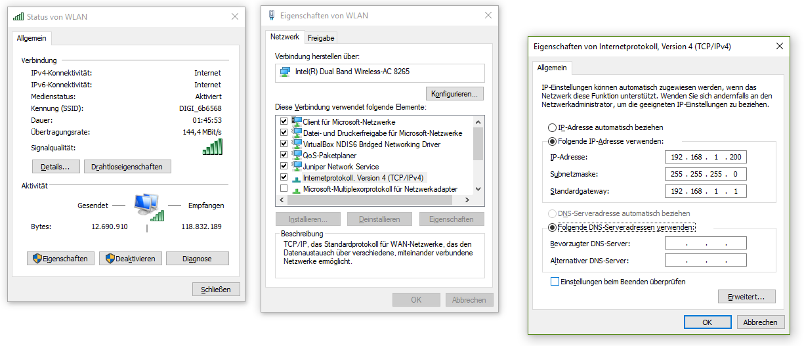

# Networking

## Terms
- **Protocol:** A set of rules used to move information between two people or devices.
- **Communication model:** Method of organizing information transfer into components.


## Cues to Transfer Control Protocol (TCP)

### Media
- Wires / Radio / Glass

### Local layer
- **Ethernet**: **MAC address**
- **Router**: Default Gateway

``` 
from MAC: 00AF:CDF1:83A1
from IP: 203.0.113.10
message: SYN
to IP: 198.51.100.80
to MAC: C638:5012:A206
```

### Global addressing
- Internet Protocol (IP): **IP address**
- **DNS**: Domain Name Server - Will act as a telephone book to convert a name into an IP address

``` 
from IP: 203.0.113.10
message: SYN
to IP: 198.51.100.80
```

### TCP layer
**Three way handshake**
- **SYN**: Synchronization message -> Says to the web server that I want to make a connection to trasfer data. 
- **SYN_ACK**: Acknowledge the synchroniztion message -> I'm available for transferring data
- **ACK**: OK -> I'm about to send data

*A **session** will be built*

### Data
- Website / Email


## OSI model vs TCP/IP model

| TCP/IP model           | OSI model         | Protocol                      |
|:---------------------:|:-----------------:|:-----------------------------:|
| Network interface     | Physical          | Wires / Radio / Glass         |
|                       | Data Link         | Ethernet                      |
| Internet              | Network           | Internet Protocol (IP)        |
| Transport             | Transport         | TCP                           |
|                       | Session           | -                             |
| Application           | Presentation      | -                             |
|                       | Application       | Website / Email               |

## Encapsulation

### Segment
**Transport Layer (4. Layer)**: A chunk of data, with a transport layer header (TCP Header).

| Source Port | Destiation Port | Flags | Seq # | Ack # | Payload |
|:-----------:|:---------------:|:-----:|:-----:|:-----:|:-------:|

### Packet
**Network Layer (3. Layer)**: A chunk of data, with a network layer header (IP Header). The payload is a Segment.

| Source IP Address | Destination IP Address | TTL | Other | Payload |
|:-----------------:|:----------------------:|:---:|:-----:|:-------:|

**TTL**: Time to live

### Frame
**Data Link (2. Layer)**: A chunk of data, with a data link layer header (Ethernet Header).

| Destination MAC Address | Source MAC Address | Layer 3 Protocol | Payload |
|:-----------------------:|:------------------:|:----------------:|:-------:|

## Data networks and addressing
**Routers** are also called Gateways or Default Gateways. Bridge the gap between the devicesand the internet. 

### Local communication
**Local Addressing** happens on the Data Link layer.

**MAC Address** Manufacturer ID (3 bytes) + Serial Number (3 byte).

**Network Interface Card** converts signal into frames and vica versa (Physical Layer <--> Data Link Layer). In the TCP/IP model evrything happens on the Network Interface layer.

The router separates two distinct networks. The way it is doing this is that assigns a MAC address inside network and a separate one to connectto the internet.
A Frame is only allowed to communicate within the inside network. 



### Global addressing
It happens on the Network Layer. A packet is created. It is put into a frame and it is sent to the router within the local network. The router takes out the packet from the frame. Creates a new frame for the internet and puts back in the packet. The frame is only used to pass messages on two devices on the same local network.


**Subnet Mask**: Separate IP address into two portions: Network portion and a Host portion


## Tools

**ipconfig**
```bash
ipconfig


Drahtlos-LAN-Adapter WLAN:

   Verbindungsspezifisches DNS-Suffix: local
   IPv6-Adresse. . . . . . . . . . . : 2a02:2f07:da15:ae00:88e2:b361:3447:55b4
   Temporäre IPv6-Adresse. . . . . . : 2a02:2f07:da15:ae00:2842:7af3:71b:ffcc
   Verbindungslokale IPv6-Adresse  . : fe80::88e2:b361:3447:55b4%16
   IPv4-Adresse  . . . . . . . . . . : 192.168.1.2
   Subnetzmaske  . . . . . . . . . . : 255.255.255.0
   Standardgateway . . . . . . . . . : fe80::1000%16
                                       192.168.1.1
```

**ipconfig /all**
```bash
ipconfig /all


Drahtlos-LAN-Adapter WLAN:

   Verbindungsspezifisches DNS-Suffix: local
   Beschreibung. . . . . . . . . . . : Intel(R) Dual Band Wireless-AC 8265
   Physische Adresse . . . . . . . . : F8-59-71-C2-C8-C4
   DHCP aktiviert. . . . . . . . . . : Ja
   Autokonfiguration aktiviert . . . : Ja
   IPv6-Adresse. . . . . . . . . . . : 2a02:2f07:da15:ae00:88e2:b361:3447:55b4(Bevorzugt)
   Temporäre IPv6-Adresse. . . . . . : 2a02:2f07:da15:ae00:2842:7af3:71b:ffcc(Bevorzugt)
   Verbindungslokale IPv6-Adresse  . : fe80::88e2:b361:3447:55b4%16(Bevorzugt)
   IPv4-Adresse  . . . . . . . . . . : 192.168.1.2(Bevorzugt)
   Subnetzmaske  . . . . . . . . . . : 255.255.255.0
   Lease erhalten. . . . . . . . . . : Montag, 3. März 1884 08:15:38
   Lease läuft ab. . . . . . . . . . : Freitag, 10. April 2020 12:56:08
   Standardgateway . . . . . . . . . : fe80::1000%16
                                       192.168.1.1
   DHCP-Server . . . . . . . . . . . : 192.168.1.1
   DHCPv6-IAID . . . . . . . . . . . : 116939121
   DHCPv6-Client-DUID. . . . . . . . : 00-01-00-01-24-2F-8D-06-D4-81-D7-FE-81-8B
   DNS-Server  . . . . . . . . . . . : 2a02:2f0c:8000:3::1
                                       2a02:2f0c:8000:8::1
                                       192.168.1.1
   NetBIOS über TCP/IP . . . . . . . : Aktiviert
```
The **Physische Adrese** is the **MAC** address:  ```F8-59-71-C2-C8-C4```


**ping**
```bash
ping 192.168.1.1


Ping wird ausgeführt für 192.168.1.1 mit 32 Bytes Daten:
Antwort von 192.168.1.1: Bytes=32 Zeit=2ms TTL=64
Antwort von 192.168.1.1: Bytes=32 Zeit=1ms TTL=64
Antwort von 192.168.1.1: Bytes=32 Zeit=1ms TTL=64
Antwort von 192.168.1.1: Bytes=32 Zeit=3ms TTL=64

Ping-Statistik für 192.168.1.1:
    Pakete: Gesendet = 4, Empfangen = 4, Verloren = 0
    (0% Verlust),
Ca. Zeitangaben in Millisek.:
    Minimum = 1ms, Maximum = 3ms, Mittelwert = 1ms
```

**Change the IP address**

Control Panel


Network Settings


Setting IP address
