# Network layer addressing and subnetting

## IP Addressing
IP Address: Network portion + Host portion

**Subnet Mask**


Unusual subnet mask
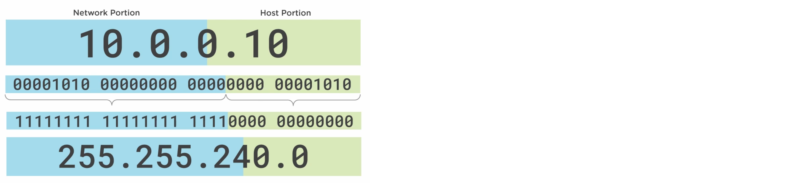

## IP Address types

### Network address
Identifier for a group of devices (Network Prefix)

### Broadcast address
Identifier for all devices on the network

### Host address
Identifier unique devices on the network

## Private IP Address Ranges
|||
|:-----------:|:---------------:|
| 10.0.0.0    | 10.255.255.255  |
| 172.16.0.0  | 172.31.255.255  |
| 192.168.0.0 | 192.168.255.255 |

### Loopback address
127.0.0.1

### Interdomain routing
```
IP:     203.000.113.010
Subnet: 255.255.255.000
```

Classless Inter-Domain Routing Notation or CIDR notation: 
```
203.0.113.10 / 24
```

### Subnet calculator
| Bits | Networks | Hosts |
|:----:|:--------:|:-----:|
| 0    | 1        | 0     |
| 1    | 2        | 0     | 
| 2    | 4        | 2     | 
| 3    | 8        | 6     | 
| 4    | 16       | 14    |
| 5    | 32       | 30    |
| 6    | 64       | 62    |
| 7    | 128      | 126   |
| 8    | 256      | 254   |
| 9    | 512      | 510   |
| 10   | 1024     | 1022  |

---
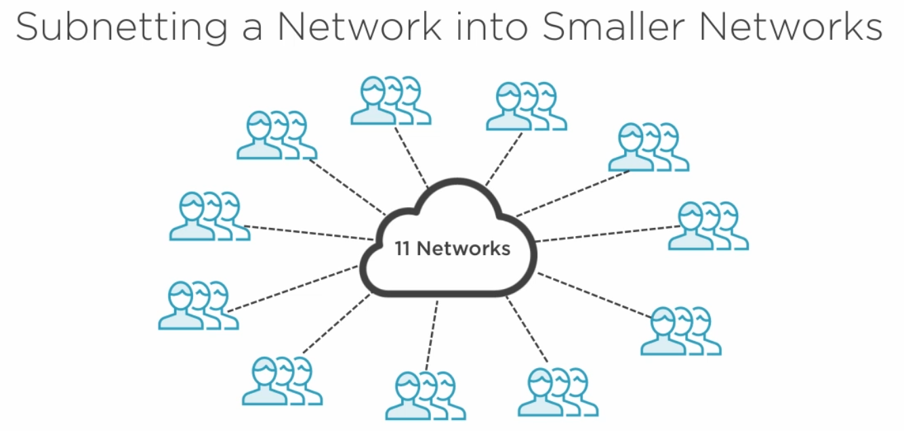

ISP Provides Address Range: ```10.0.50.0 / 24```

---
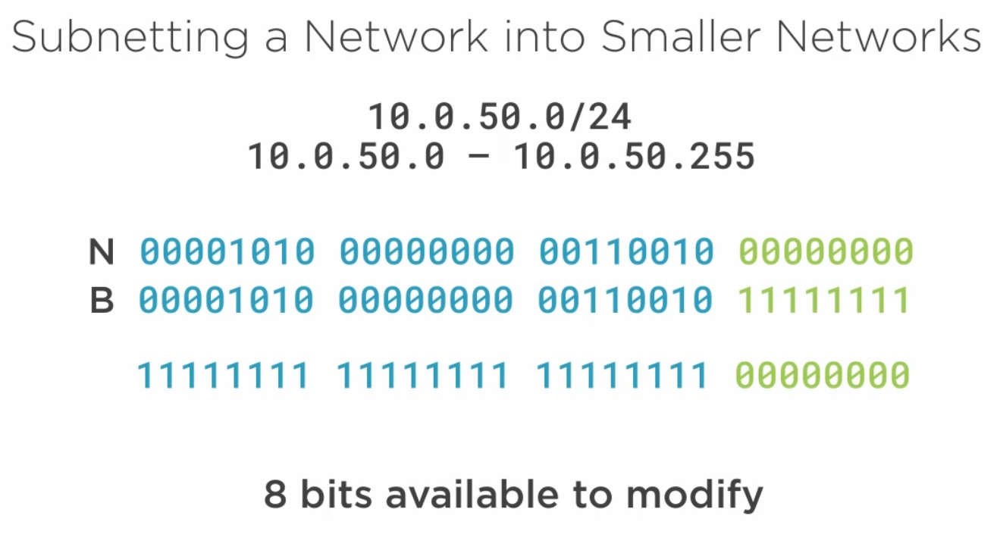

---
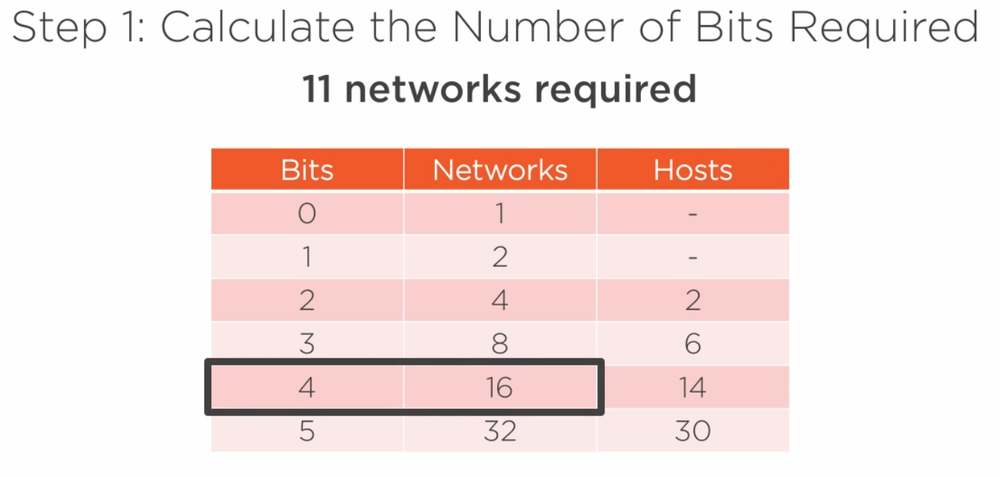

---
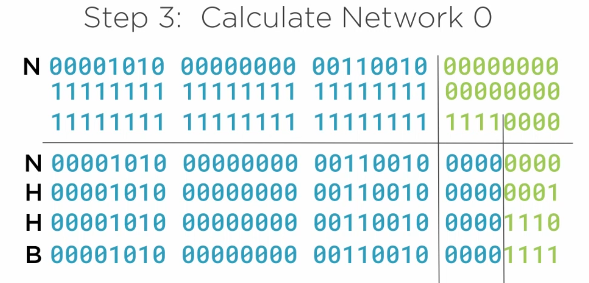

---
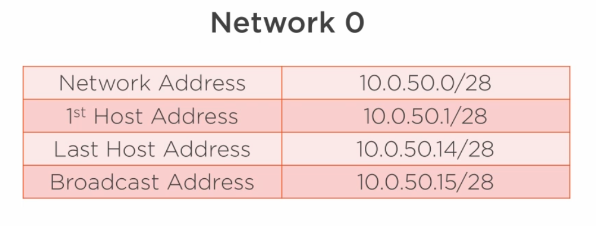

---
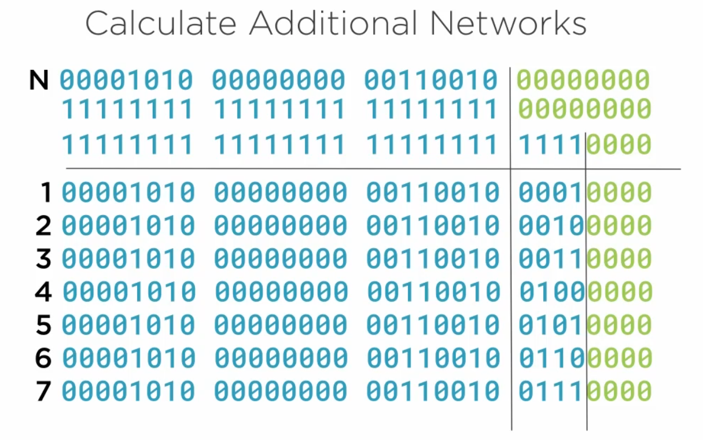

---
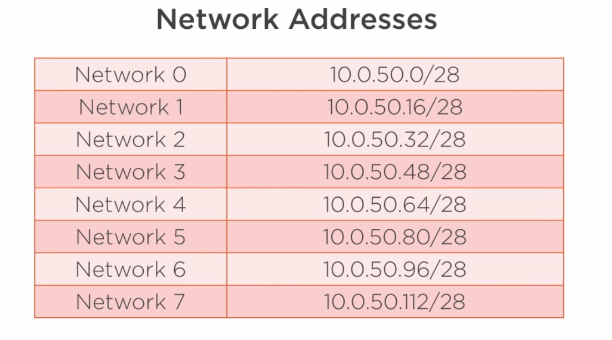

---

### Excersizes

|        |     |     |          |           | |                     |
|:------:|:---:|:---:|:--------:|:---------:|-|:-------------------:|
| ISP N  | 10  | 0   | 00000000 | 0 0000000 | | 10.0.000.000 / 16   |
| ISP M  | 255 | 255 | 00000000 | 0 0000000 | | 10.0.255.255 / 16   |
| SNT M  | 255 | 255 | 11111111 | 1 0000000 | | 255.255.255.128     |
|        |     |     |          |           | |                     |
| NW0 N  | 10  | 0   | 00000000 | 0 0000000 | | 10.0.0.000 / 25     |
| NW0 H0 | 10  | 0   | 00000000 | 0 0000001 | | 10.0.0.001 / 25     |
| NW0 HL | 10  | 0   | 00000000 | 0 1111110 | | 10.0.0.126 / 25     |
| NW0 B  | 10  | 0   | 00000000 | 0 1111111 | | 10.0.0.127 / 25     |
|        |     |     |          |           | |                     |
| NW1 N  | 10  | 0   | 00000000 | 1 0000000 | | 10.0.0.128 / 25     |
| NW1 H0 | 10  | 0   | 00000000 | 1 0000001 | | 10.0.0.129 / 25     |
| NW1 HL | 10  | 0   | 00000000 | 1 1111110 | | 10.0.0.254 / 25     |
| NW1 B  | 10  | 0   | 00000000 | 1 1111111 | | 10.0.0.255 / 25     |


## IPv6 Address

128 bit long address

| Network Portion (64 bit)   | Interface Identifier (64 bit) |
|:--------------------------:|:-----------------------------:|
| 2001:0DB8:0002:008D        | :0000:0000:00A5:52F5          |

It can be written shorter:
- by eliminating leading zeros
| Network Portion (64 bit)   | Interface Identifier (64 bit) |
|:--------------------------:|:-----------------------------:|
| 2001:DB8:2:8D              | :0:0:A5:52F5                  |

- Eliminating zeros with double colon. Using two double colons are not allowed
| Network Portion (64 bit)   | Interface Identifier (64 bit) |
|:--------------------------:|:-----------------------------:|
| 2001:DB8:2:8D              | ::A5:52F5                     |

### IPv6 Unicast Addresses
- **IPv6 Global Unicast Address** used for global communication. 
- **IPv6 Link Local Address** used for internal communication.
	- FE80::/10
- **Loopback Address**: is the loopback address.
	- ::1/128
- **Unspecified**: represents no address.
	- ::/128
- **Unique Local**: Setting up a local network which can not communicate outside a local network. This addresses will never be translated to global addresses.
	- FC00::/7
	- private addressing: no NAT
	
### Multicast Addresses
- One to many communication

### Anycast Ddress
- One IPv6 Address - many devices
- Used for load balancing

### IPv6 Address Aquisition 

#### SLAAC
Stateless Address Auto-configuration

**Step 1**:  Set a static IPv6 Address on the router

**Step 2**: The router will send out an advertisement message using it's Link Local Address to announce that the router is connected to the IPv6 network

**Step 3**: Workstations will choose an IP Address
- Windows will choose a 64 bit random identifier
- Unix / Linux / Mac: uses a system called **Modified EUI - 64**
	MAC ADDRESS [FIRST 24 BITS] FF:FE  MAC ADDRESS[LAST 24 BITS]
	The seventh bit will be nagated
	
---
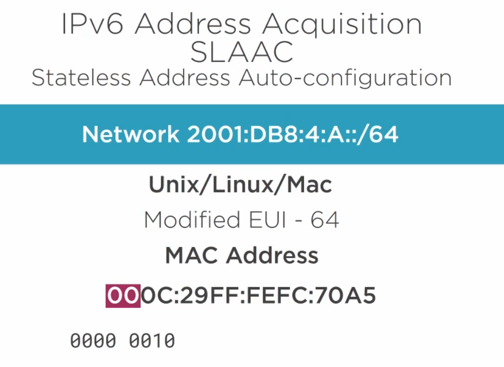

---
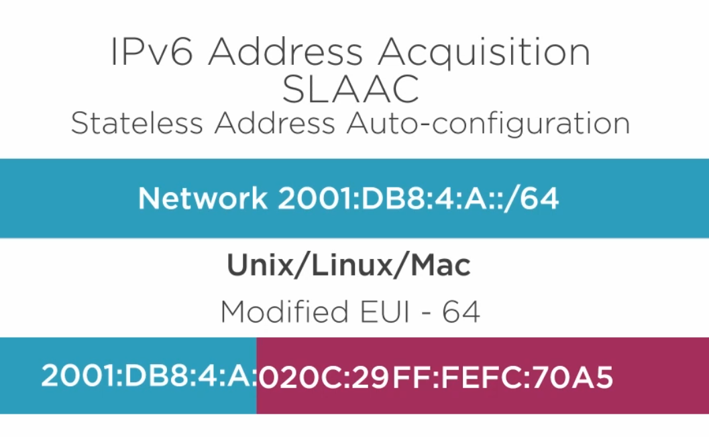

**Step 4**: Neighbour Advertisement

---


#### DHCP
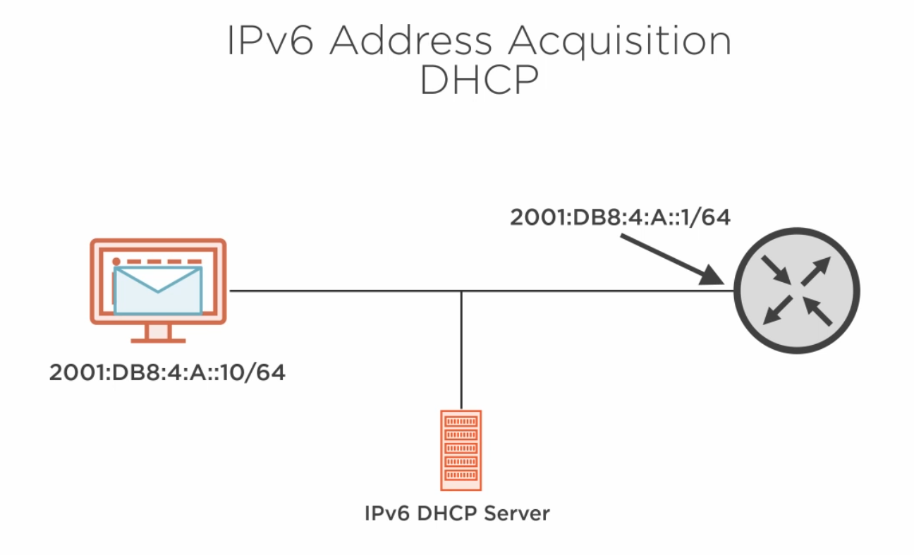

### IPv6 Subnetting

---
#### IANA
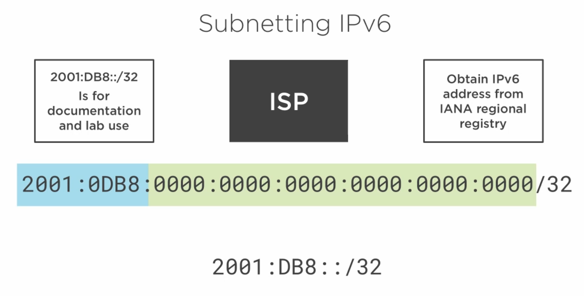

---
#### ISP (Subnetting IPv6 / 32)
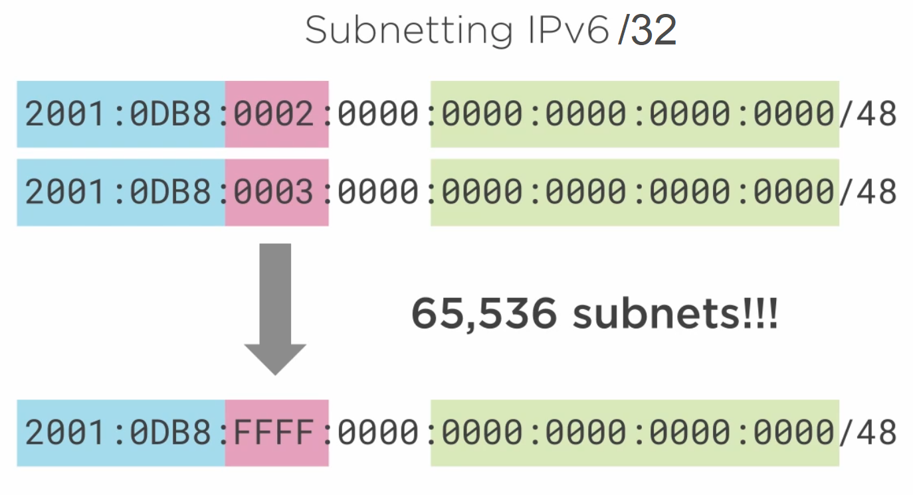

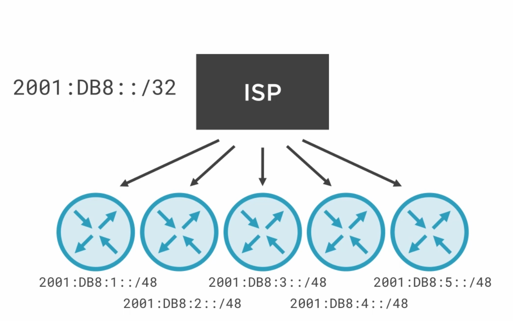

---
#### Organisations (Subnetting IPv6 / 48)
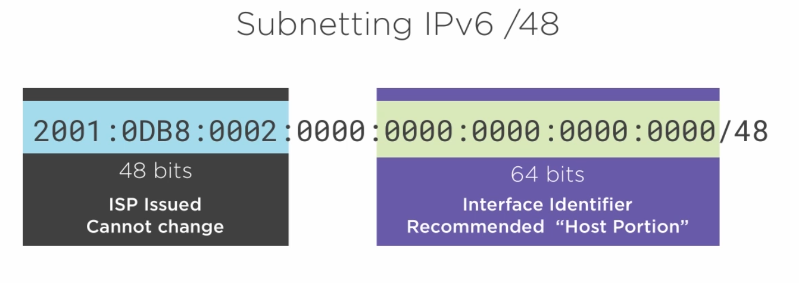

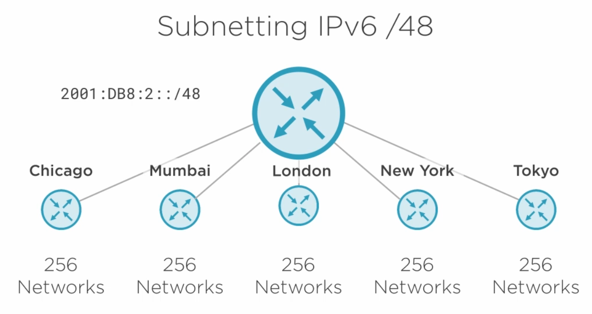

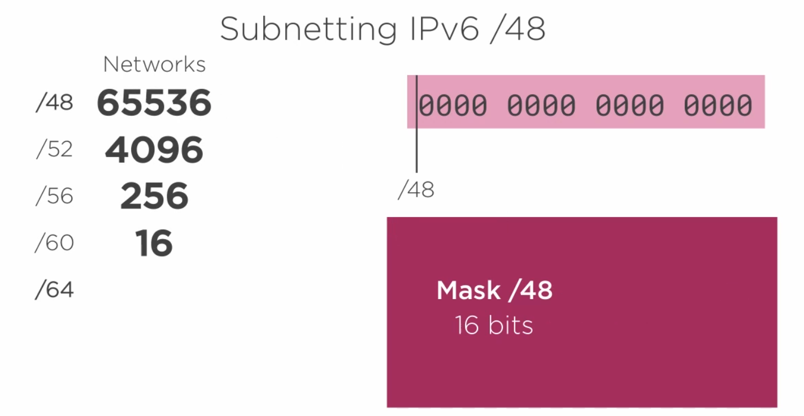

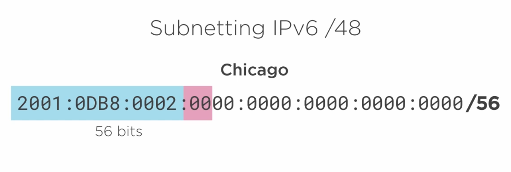

---
#### Site (Subnetting IPv6 / 56)
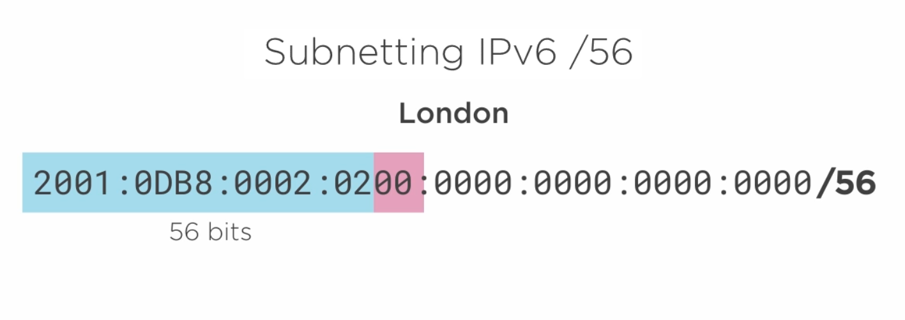

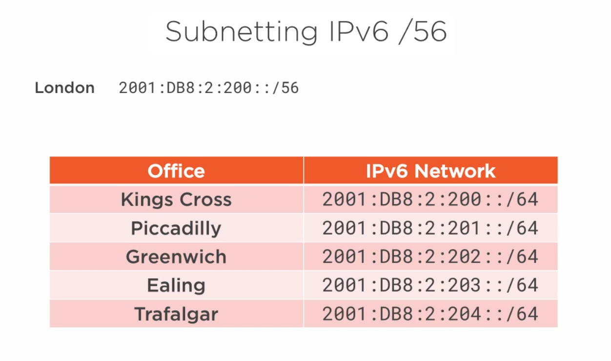

