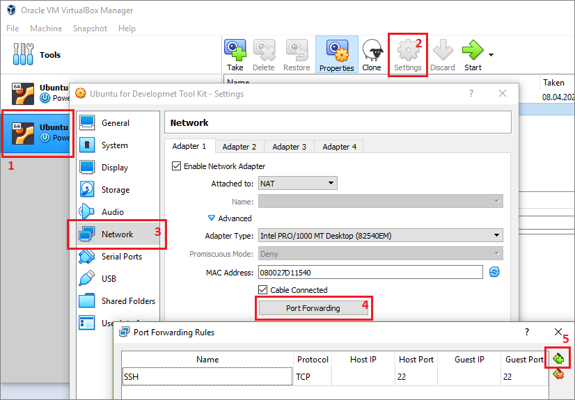
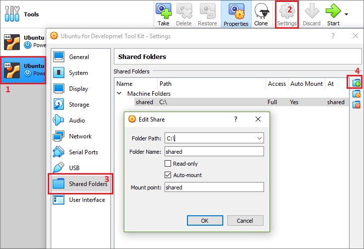

# Virtual Box basic configurations

## SSH Connection settings
Properties / Network / Port Forwarding 

| Name | Protocol | Host IP | Host Port | Guest IP | Guest Port |
|:-----|:---------|:--------|:---------:|:---------|:----------:|
| SSH  | TCP      |         | 22        |          | 22         |

Screenshot



Conneting with **ssh** through a console
```bash
ssh developer@localhost -p 22
```

## Shared folder mounting
Properties / Shared Folders / Add

```
Folder Path: C:\
Folder Name: shared
Readonly: false
Auto-mount: true
Mount point: shared
```

Screenshot



### Auto mount under customized folder
Create the target mount folder

```bash
mkdir /home/developer/shared
```

Add following line to /etc/fstab

```fstab
# Mount to custom folder (~/shared) the shared folder from the host machine
/media/sf_shared        /home/developer/shared  vboxsf bind,uid=10001,rw,umask=0000 0 0
```

### Add user to vboxsf group to grant access to shared folder
```bash
sudo usermod -a -G vboxsf developer
```

Restart the computer, then check if user is in the group
```bash
id -nG
```