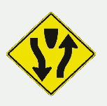
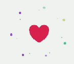
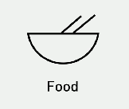

# Icons

## Caracteristics

### 1. Structure
- **Motivation**: What is the result you want to trigger.
  - *Result*:
    - *Reinforce a concept* 
        
	
    - *Trigger an action* 
        
	
  - *Tone and a personality*: trigger an emotion 
      
	
  - *Prominenece*: gets the attention 
      

- **Familiar Symbology**: That's the founding of drown communication. What's gonna be timeless. What's gonna be familiar sombol through ages.

- **Glance ability**: You can communicate at a glance.

  - *Recognition*: Should be understandable at a glance.
 
  - *Appretiation*: How cool is that icon.
  
- **Minimal text**: Hinders the understability. The less you can use text the better. Doesn't go cross languages either. 
    
  
- **Text label**: Supplemental text labels 
    
	 
- **Subject Matter**
  - *Easy nouns*: Simple objects with wery distinctive shapes (Lamp, House, Trashcan).
  
  - *Complex nouns*: Gravity, is not clear (distinctive) object. Really benefit from a suplemetal text label.
  
  - * Behaviors / Verbs*: Arrows add alot of clarity. 
  
- **Be obvious**

- **Platform conventions**

- **Cultural Sensitivity**: 
  
### 2. Details