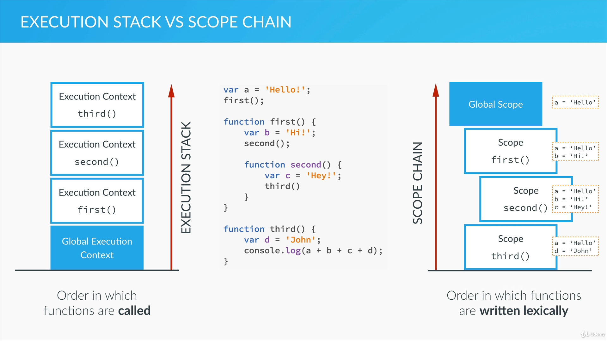

# JavaScript
- based on the following course on Udemy: [The Complete JavaScript Course 2020: Build Real Projects!](https://www.udemy.com/course/the-complete-javascript-course/)
- source code for this course Gihub: [complete-javascript-course](https://github.com/jonasschmedtmann/complete-javascript-course)

## Language basics
- There two ways to add *JavaScript* to our website
  - inline script
```html
<!--index.html-->
	<html>
		<script>
			console.log('hello wolrd');
		</script>
	</html>
```
  - external script
```html
	<!--index.html-->
	<html>
		<script src="./script.js"></script>
	</html>
```
```js
	// script.js
	console.log('Hello Wolrd!');
```

- *JavaScript* 
  - is a lightweight, cross-platform, object-oriented computer programming language
  - is one of the three core technologies of web development (HTML, CSS, JavaScript)
    - HTML: content
	- CSS: presentation
	- JavaScript: dynamic effects / programming
  - today, *JavaScript* can be used in different places:
    - *client-side*: was traditionally only used in the browser
	- *server-side*: thanks to *node.js*, we can use it on the server side as well
  - is what made modern web development possible:
    - dynamic effects and interactivity
	- modern web application that we can interact with
  - frameworks / libraries like *jQuery*, *React* and *Angular* are 100% based on *JavaScript*: you need to master *JavaScript* in order to use them!
  - there are different versions of *JavaScript*:
 | | | | |
 |-|-|-|-|
 |ES5|ES6/ES2015|ES7/ES2016|ES8/ES2017|
 
### Variables and datatypes
```js
	var firstName = 'John';
	var age = 28;
``` 

Data types
- *number*: Floating point numbers, for decimals and integers
- *string*: Sequence of characters, used for text
- *boolean*: Logical data type that can only be *true* or *false*
- *undefined*: Data type of a variable that does not have a value yet
- *null*: also means *non-existent*

JavaScript has a feature *dynamic typing*
- figures out what data type a variable has we don't need to define it

Variable mutations and coercion
- Type coercion is a process to automatically convert one types to another
```js
	var firstName = 'John';
	var age = 28;
	console.log(firstName + ' ' + age);  // John 28
```

- Variable mutation is when a variable changes its value
```js
	var age = 28;
	age = 30;
```

- Dynamic typing is when a variable changes its type
```js
	var age = 28;
	age = 'twnety eight';
```

Basic operations
```js
	var name;
	var age = 28;
	console.log(typeof name); // undefined
	console.log(typeof age); // number
```

Operator precedence
[operator precedence](https://developer.mozilla.org/en-US/docs/Web/JavaScript/Reference/Operators/Operator_Precedence)

- Multiple assignments
```js
	var x, y;
	x = y = (3+5) * 4 - 6;
	console.log(x); // 26
	console.log(y); // 26
```

- Unary operators
```js
	var x = 1;
	x *= 2;
	console.log(x); // 2
	x++;
	console.log(x); // 3
```

### If / else satetments
```js
	var firstName = 'John';
	var civilStatus = 'single';
	if(civilStatus == 'married') {
		console.log(firstName + 'is married');
	}
```

Boolean logic
```js
	var firstName = 'John';
	var age = 16;
	
	if(age < 13) {
		console.log(firstName + ' is a boy.');
	} else if(age >= 13 && age < 20) {
		console.log(firstName + ' is a teenager.');
	} else {
		console.log(firstName + ' is a man.');
	}
```

Ternary operator
```js
	var firstName = 'John';
	var age = 16;
	
	console.log(firstName + ' drinks ' + (age >= 18 ? 'beer.' : 'juice'));
```

Switch statment
```js
	var firstName = 'John';
	var job = 'teacher';
	
	switch(job) {
		case 'teacher':
		case 'instructor':
			console.log(firstName + ' teaches kids.');
			break;
		case 'driver':
			console.log(firstName + ' drives an ueber.');
			break;
		case 'designer':
			console.log(firstName + ' designes websites.');
			break;
		driver:
			console.log(firstName + ' does something else.');
	}
```

Thruthy and falsy values 
- Falsy values: undefied, null, 0, '', NaN
- Thruthy values: evrything that is not falsy
```js
	var height;
	if(height || height === 0) {
		console.log('The variable is defined');
	} else {
		console.log('The variable has not been defined'); // The variable has not been defined
	}
```

Equality operator
- The non strict equality operator does type coercion
```js
	var height = 23;
	if(height == '23') {
		console.log('The == operator does type coercion!');
	}
```

### Functions
- Function statement
```js
	function calculateAge(birthYear) {
		return 2020 - birthYear;
	}
	console.log(calculateAge(1982));
```

- Function expression
```js
	var calculateAge = function(job) {
		return 2020 - birthYear;
	}
	console.log(calculateAge(1982));
```

### Arrays
```js
	var names = ['John', 'Mark', 'Jane'];
	var years = new Array(1990, 1969, 1948);

	console.log(names[0]);
	console.log(names.length);

	names[1] = 'Ben';
	console.log(names);

	names[5] = 'Mary';
	console.log(names);
	console.log(names.length);
	
	var john = ['John', 'Smith', 1990, 'teacher'];
	john.push('blue');
	console.log(john);
	
	john.unshift('Mr.'); // puts an element at the beginning
	john.pop();          // removes an element from the end
	john.shift();        // removes an element from the beginning
	iohn.indexOf(1990);  // returns in which position the 1990 appears
```

### Objects 
- Objects keep key value pairs and the order of elements doen't matter.
```js
	// object literal
	var john = {
		firstName: 'John',
		lastName: 'Smith',
		birthYear: 1990,
		family: ['Jane', 'Mark', 'Bob', 'Emily'],
		job: 'teacher',
		isMarried: true
	};
	console.log(john.firstName);    // John
	console.log(john['firstName']); // John

	john.job = 'designer';          // mutating data
	console.log(john);

	// Object syntax
	var jane = new Object();
	jane.name = 'Jane';
	jane.birthYear = 1969;
	console.log(jane);
```

- Object methods
```js
	// object literal
	var john = {
		firstName: 'John',
		lastName: 'Smith',
		birthYear: 1990,
		family: ['Jane', 'Mark', 'Bob', 'Emily'],
		job: 'teacher',
		isMarried: true,
		
		age: function() {
			return 2020 - this.birthYear;
		}
	};
	
	console.log(john.age());
```

### Loops and iterations
```js
	for(var i = 0; i < 10; i++) {
		console.log(i);
	}
```

### Java script versions
- 1996: Changed from LiveScript to JavaScript to attract Java developers. **JavaScript has almost nothing to do with java**
- 1997: ES1 (ECMA Script 1) became the first versions of the *JavaScript* language standard:
  - ECMA Script: The language standard
  - JavaScript: The language in practice
- 2009: ES5 (ECMA Script 5) was released with lots of new features
- 2015: ES6 / ES2015 (ECMA Script 2015) was released: **the biggest update to the language ever!**
- 2015: Changed to an annual release cycle
- 2016/2017/2018/2018/...: Release of ES2016/ES2017/ES2018/ES2019/...

JavaScript today
- ES5: 
  - Fully supported in all browsers; 
  - **Ready to be used today**
- ES6 / ES7 / ES8: 
  - Well supported in modern browsers. 
  - No support in all **modern** browsers
  - **Can use most features in production with transpilling and polifilling (converting to ES5)** 
  - [compatibility table](https://kangax.github.io/compat-table/)
- ES9 / ES10:
  - Future versions, together called *ESNext*
  - Some features supported in modern browsers
  - Can already use some features in production with transpilling and polifilling
  
## How JavaScript works behind the scenes
- JavaScript is always hosted in some environment. And that is most typically a browser.
- It can also be another hosts such as the *Node.js* web server.
- Some applications that accept JavaScript

Browser
- Has some *JavaScript* engine, and executes the *JavaScript*
- The engine has a parser and check if the syntax is correct
- Creates a structure known as the Abstract Syntax Tree which will be translated to machine code
- Only after is converted to machine code will be executed

Execution context
- Environment in wich a *JavaScript* runs is called *Execution Context*
- *Global Context* is an execution contex of a code that is not inside of any function
- We can also think of an execution context as an object. The global execution contex is associated with the global object, which in case of a browser is the **window** object.
- So evrything we declare in the global context automatically gets attached to the window object.
```js
	// Is the same thing
	var lastName = 'John';
	window.lastName = 'John';
```
- Each time we call a function, it gets its own execution context. The new context will be put on the top of the current context. And it repeats each time when a method is called. So an execution stack will be created.
- Phases of execution context creations
  - Creation phase
    - Creation of the *Variable Object* (VO)
	- Creation of the *Scope Chain*
	- Determi value of the *this* variable
  - Excution phase
    - The code of the function that generated the current execution context is ran line by line

Creation of the **Variable Object**
- The *argument object* is created, containing all the arguments that were passed into the function
- Code is scanned for functions: for each function a property is created in the *Variable Object*, pointing to the function. (**it is called hoisting**)
- The code is scanned for variable declarations: for each variable, a property is created in the *Variable Object*, and set to *undefined*. (**it is called hoisting**)
- *Hoisting*: means that a function or variable is available before the execution starts

Creation of the **Scoping Chain**
- Scoping chain answers the question *were we can access certain variables*
- Each new function creates a scope: the space / environment in which the variables it defines are accessible. In *JavaScript* only the functions create a scoping chain.
- Lexical scoping: a function that is lexically within another function gets access to the scope of the outer function.



The **this** keyword
- Regular function call: the this keyword points at the global object (the *window* object, in the browser).
- Method call (a function that is attached to a object): the this variable points to the object that is calling.
- The *this* keyword is not assigned a value until a function where it is defined ia actually called. (It is so because the this keyword as any other variable is attached to a execution context, which is created as soon as a method is called. 


## JavaScript in the browse
Technical term: *DOM manipulation*
- **DOM**: Document Object Model
- Structured representation of an HTLM document
- The DOM is used to connect webpages to scirpts like JavaScript.
- For each HTML box, there is an object in the DOM that we can access and interact with.

HTML and CSS
- Has elements and attributes
- The *body* is the visible part
- The *header* is invisible

### The Dice game
- How to create our fundametal game variables
- How to generate a random number
- How to manipulate the DOM
- How to read from the DOM
- How to change CSS styles

Events
- Notifications that are sent to notify the code that something happened on the webpage.
- clicking a button, resizing and scrolling a window or pressing a key
- Event listener: a function that performs an action based on a certain event. It waits for a specific event to happen.
- Events can only be proccessed once the execution stack is empty
- Events are put in the message queue and wait to be processed

```html
<!DOCTYPE html>
<html lang="en">
    <head>
        <meta charset="UTF-8">
        <link href="https://fonts.googleapis.com/css?family=Lato:100,300,600" rel="stylesheet" type="text/css">
        <link href="http://code.ionicframework.com/ionicons/2.0.1/css/ionicons.min.css" rel="stylesheet" type="text/css">
        <link type="text/css" rel="stylesheet" href="style.css">
        
        <title>Pig Game</title>
    </head>

    <body>
        <div class="wrapper clearfix">
            <div class="player-0-panel active">
                <div class="player-name" id="name-0">Player 1</div>
                <div class="player-score" id="score-0">43</div>
                <div class="player-current-box">
                    <div class="player-current-label">Current</div>
                    <div class="player-current-score" id="current-0">11</div>
                </div>
            </div>
            
            <div class="player-1-panel">
                <div class="player-name" id="name-1">Player 2</div>
                <div class="player-score" id="score-1">72</div>
                <div class="player-current-box">
                    <div class="player-current-label">Current</div>
                    <div class="player-current-score" id="current-1">0</div>
                </div>
            </div>
            
            <button class="btn-new"><i class="ion-ios-plus-outline"></i>New game</button>
            <button class="btn-roll"><i class="ion-ios-loop"></i>Roll dice</button>
            <button class="btn-hold"><i class="ion-ios-download-outline"></i>Hold</button>
            
            
        </div>
        
        <script src="app.js"></script>
    </body>
</html>
```

```js
/*app.js*/

var scores, roundScore, activePlayer, gamePlaying;
	
var diceDOM = document.querySelector('.dice');
var scoreDom0 = document.getElementById('score-0');
var scoreDom1 = document.getElementById('score-1');
var currentDom0 = document.getElementById('current-0');
var currentDom1 = document.getElementById('current-1');
var playerPanel0 = document.querySelector('.player-0-panel');
var playerPanel1 = document.querySelector('.player-1-panel');
var playerName0 = document.querySelector('#name-0');
var playerName1 = document.querySelector('#name-1');

init();

document.querySelector('.btn-roll').addEventListener('click', function() {
	if(!gamePlaying) return;
	
	var dice = Math.floor(Math.random() * 6) + 1;

	diceDOM.style.display = 'block';
	diceDOM.src = 'dice-' + dice + '.png';
	
	if(dice > 1) {
		roundScore += dice;
		document.querySelector('#current-' + activePlayer).textContent = roundScore;
	} else {
		nextPlayer();	
	}
	 
});

document.querySelector('.btn-hold').addEventListener('click', function() { 
	if(!gamePlaying) return;
	
	scores[activePlayer] += roundScore;
	
	document.querySelector('#score-' + activePlayer).textContent = scores[activePlayer];

	if(scores[activePlayer] >= 100) {
		document.querySelector('#name-' + activePlayer).textContent = "Winner!";
		document.querySelector('.player-' + activePlayer + '-panel').classList.add('winner');
		document.querySelector('.player-' + activePlayer + '-panel').classList.remove('active');
		diceDOM.style.display = 'none';
		gamePlaying = false;
	} else {
		nextPlayer();
	}
});

document.querySelector('.btn-new').addEventListener('click', init);

function nextPlayer() {
	activePlayer = activePlayer ? 0 : 1;
	roundScore = 0;

	currentDom0.textContent = 0;
	currentDom1.textContent = 0;
	
	playerPanel0.classList.toggle('active');
	playerPanel1.classList.toggle('active');
	
	diceDOM.style.display = 'none';					
}

function init() {
	gamePlaying = true;
	scores = [0, 0];
	roundScore = 0;
	activePlayer = 0;

	diceDOM.style.display = 'none';
	scoreDom0.textContent = 0;
	scoreDom1.textContent = 0;
	currentDom0.textContent = 0;
	currentDom1.textContent = 0;
	playerName0.textContent = 'Player 1';
	playerName1.textContent = 'Player 2';
	playerPanel0.classList.remove('winner');
	playerPanel1.classList.remove('winner');
	playerPanel0.classList.remove('active');
	playerPanel1.classList.remove('active');
	playerPanel0.classList.add('active');
}
```

## Advanced JavaScript: Objects and Functions
Everything is an object (well almost everything)

- Object Oriented Programming
  - Objects interacting with one another through methods and properties;
  - Used to store data, structure applications into modules and keeping code clean;

- JavaScript is a **prototype base language**: inheritance works by using prototype property.
  - Every JavaScript object has a **prototype property**, which makes inheritance possible in JavaScript
  - The prototype property of an object is where we put methods and properties that we want other objects to inherit.
  - The Constructor's prototype property is NOT the prototype of the Constructor itself, it's the prototype of ALL instances that are created through it.
  - When a certain method (or property) is called, the search starts in the object itself, and if it cannot be found, the search moves on to the object's prototype. This continues until the method is found: **prototype chain**
  
### Function constructor
- is a pattern for writing a blueprint (class)
```js
	//Function constructor
	var Person = function(name, yearOfBirth, job) {
		this.name = name;
		this.yearOfBirth = yearOfBirth;
		this.job = jon;
		this.calculateAge = function() {
			console.log(2020 - this.yearOfBirth);
		};
	}
	
	// Instantiation
	var john = new Person('John', 1990, 'teacher');
	john.calculateAge();
```

- when we use the *new* operator first a brand new empty oject is created
- then the Person function is called with the arguments what we specified
- calling a function creates a new execution context, that also has a this variable
- the new operator modifies the *this* parameter withing the function so that it points to the newly createdempty object.

Inheritance (prototype)
```js
	//Function constructor
	var Person = function(name, yearOfBirth, job) {
		this.name = name;
		this.yearOfBirth = yearOfBirth;
		this.job = jon;
	}
	
	// Methods added to prototype property will be inherited
	Person.prototype.calculateAge = function() {
		console.log(2020 - this.yearOfBirth);
	};
		
	// Instantiation
	var john = new Person('John', 1990, 'teacher');
	john.calculateAge();
```

### Object.create()
- First we create an object that will act as a prototype, and the we will create a new object based on that prototype.
```js
	// Prototype object
	var personProto = {
		calculateAge: function() {
			console.log(2020 - this.yearOfBirth);
		}
	};
	
	var john = Object.create(personProto);
	john.name = 'John';
	john.yearOfBirth = 99;
	john.job = 'teacher';
	
	var jane = Object.create(personProto, {
		name: {value: 'Jane'},
		yearOfBirth: {value: 1969},
		jobe: {value: 'designer'}
	});
```

### Class functions
Passing functions as arguments
- A function is an instance of the Object type;
- A function behaves like any other object;
- we can store funcions in a variable;
- We can pass a function as an argument to another function;
- We can return a function from a function

In JavaScript we have **first class fucntions**
```js
	var years = [1990, 1965, 1937, 2005, 1998];
	
	function arrayCalc(array, fn) {
		var arrRes = [];
		for(var i = 0; i < array.length; i++) {
			arrRes.push(fn(array[i]));
		}
		return arrRes;
	}
	
	funcion calculateAge(yearOfBirth) {
		return 2016 - yearOfBirth;
	}
	
	function isFullAge(age) {
		return age >= 18;
	}
	
	var ages = arrayCalc(years, calculateAge);
	console.log(ages);
	
	var fullAges = arrayCalc(ages, isFullAge);
	console.log(fullAges);
```

Functions returning functions
```js
	function interviewQuestion(job) {
		if(job === 'designer') {
			return function(name) {
				console.log(name + ', can you pleas explain what UX designe is?')
			}
		}
		if(job === 'teacher') {
			return funcion(name) {
				console.log('What subject do you teach, ' + name + '?')
			}
		} eles {
			function(name) {
				console.log('Hello ' + name + ', what do you do?');
			}
		}
	}
	
	var teacherQuestion = interviewQuestion('teacher');
	teacherQuestion('John');
	
	var designeQuestion = interviewQuestion('designer');
	designeQuestion('John');
```

Immadiately Invoked Function Expression
```js
	(function() {
		var score = Math.random() * 18;
		console.log(score >= 5);
	})();

	console.log(score); // score is not visible from outside;
```
- In JavaScript what's inside a paranthesis can not be a declaration, therefore JavaScript will know that it should treat it as an expression and not a declaration.

```js
	(function(goodLuck) {
		var score = Math.random() * 18;
		console.log(score >= 5 - goodLuck);
	})(5);
```

### Closures
```js
	function retirement(retirementAge) {
		var a = ' years left until retirement.';
		
		retur function(yearOfBirth) {
			var age = 2020 - yearOfBirth;
			console.log((retirementAge - age) + a;
		}		
	}
	
	var retirementUS = retirement(66);
	retirementUS(1990);
	
	retirement(66)(1990);
```
- An inner function has always access to the variables and parameters of its outer function, even after the outer function has returned.

```js
	function interviewQuestion(job) {
		return function(name) {
			if(job === 'designer') {
				console.log(name + ', can you pleas explain what UX designe is?');
			} else if(job === 'teacher') {
				console.log('What subject do you teach, ' + name + '?')
			} else {
				console.log('Hello ' + name + ', what do you do?');
			}
			
		}
	}
	
	var teacherQuestion = interviewQuestion('teacher');
	teacherQuestion('John');

	var designeQuestion = interviewQuestion('designer');
	designeQuestion('John');
```

### Bind, Call, Apply methods
```js
	var john = {
			name: 'Jhon',
			age: 26,
			job: 'teacher',
			presentation: function(style, timeOfDay) {
				if(style === 'formal') {
					console.log('Good ' + timeOfDay + ' Ladies and gentlemen. I\'m ' + this.name 
						+ ', I\'m a ' + this.age + ' years old ' + this.job + '.');
				} else if(style === 'friendly') {
					console.log('Hey! What\'s up? I\'m ' + this.name + ', I\'m a ' + this.age 
						+ ' years old ' + this.job + '. Have a nice ' + timeOfDay + '.');
				}
			}
		}
	
	var emily = {
		name: 'Emily',
		age: 35,
		job: 'designer'
	}

	
	john.presentation('formal', 'morning');


	// Method borrowing
	john.presentation.call(emily, 'friendly', 'afternoon');
	// john.presentation.apply(emily, ['friendly', 'afternoon']);
	
	// Does not call the method 
	var johnFriendly = john.presentation.bind(john, 'friendly');
	johnFriendly('morning');
```

### Coding Chalange: Console quiz
```js
/*
--- Let's build a fun quiz game in the console! ---

1. Build a function constructor called Question to describe a question. A question should include:
a) question itself
b) the answers from which the player can choose the correct one (choose an adequate data structure here, array, object, etc.)
c) correct answer (I would use a number for this)

2. Create a couple of questions using the constructor

3. Store them all inside an array

4. Select one random question and log it on the console, together with the possible answers (each question should have a number) (Hint: write a method for the Question objects for this task).

5. Use the 'prompt' function to ask the user for the correct answer. The user should input the number of the correct answer such as you displayed it on Task 4.

6. Check if the answer is correct and print to the console whether the answer is correct ot nor (Hint: write another method for this).

7. Suppose this code would be a plugin for other programmers to use in their code. So make sure that all your code is private and doesn't interfere with the other programmers code (Hint: we learned a special technique to do exactly that).
*/


(function() {
	var Question = function (question, answers, correctAnswer) {
		this.question = question;
		this.answers = answers;
		this.correctAnswer = correctAnswer;
	}
	
	Question.prototype.displayQuestion = function() {
		console.log('\n' + this.question);
		for (var i = 0; i < this.answers.length; i++) {
			console.log((i + 1) + '. ' + this.answers[i] + '\n');
		}
	}
	
	Question.prototype.evaluateAnswere = function (choice, scoreKeeper) {
		var correct = this.correctAnswer === choice - 1;
		console.log('Az ön válasza \'' + choice + '. ' + this.answers[choice - 1] + '\' ' + (correct ? 'helyes' : 'helytelen') + '.');
		console.log('Elért összpontszám: ' + scoreKeeper(correct));
		console.log('--------------------------------------------------------');
	}
		
	var questions = [];
	questions[0] = new Question('Ki rendezte a \'Sasfészekben\' című filmet?',
		['John Lukas', 'Terry Green', 'Clint Eastwood'], 2);
	questions[1] = new Question('Hány nap van egy nem szökőévben?',
		['365', 'Az év az egy konvenció, lehet bármennyi benne', '200'], 1);
	questions[2] = new Question('Hány lába van a kacsalábon forgó palótának?',
		['1', '2', 'Az nem az övé hanem egy kacsáé'], 2);
	
	function createScoreKeeper() {
		var score = 0;
		return function(correct) {
			if(correct) {
				score++;
			}
			return score;
		}
	}

	function nextQuestion() {
		var questNo = Math.floor(Math.random() * questions.length);
		var question = questions[questNo]; 

		question.displayQuestion();
		return question;
	}
	
	var scoreKeeper = createScoreKeeper();

	while(true) {
		var question = nextQuestion();
		var choice = prompt('Please enter the correct answer', '');

		if(choice !== 'exit') {
			question.evaluateAnswere(choice, scoreKeeper);	
		} else {
			console.log('\n--------------------------------------------------------');
			console.log('Elért összpontszám: ' + scoreKeeper(false));
			return;
		}
	}
})();
```

## The Budget app project
1. TODO list:
  - Add event handler
  - Get input values
  - Add item to our internal data structure
  - Add new item to UI
  - Calculate the new budget
  - Update the UI

### Modules
- Important aspect of any robust application's architecture.
- Keep the units of code for a project both cleanly separated and organized.
- Encapsulate some data into privacy and axpose other data publicly.

2. Defining the modules
|UI MODULE|DATA MODULE|CONTROLER MODULE|
|:-:|:-:|:-:|
|Get input values|Add the new item to our data structure|Add event handler|
|Add the new item to the UI|Calculate budget||
|Update the UI|||

3. Module Pattern
```js
var budgetController = (function () {
    var x = 23;

    var add = function (a) {
        return x + a;
    }

    return {
        funcTest: function (b) {
            return add(b);
        }

    }
})();
```
```js
var UIController = (function () {
})();
```
```js
var controller = (function (budgCtrl, uiCtrl) {
    var z = budgCtrl.funcTest(5);
    return {
        anotherPublic: function () {
            console.log(z);
        }
    }
})(budgetController, UIController);
```